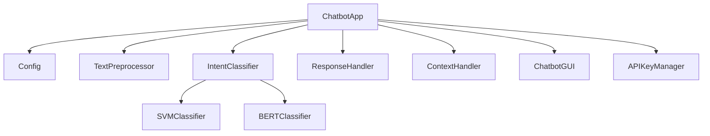

# AI Context Specification

## Project Overview

This document provides comprehensive technical context for AI models to understand the Project-FY25 Intelligent Chatbot system. This information can be used for generating improvements, documentation, or analyzing the codebase.

## Technical Architecture

### Core Components Hierarchy
```
ChatbotApp (main.py)
├── Config (config.py)
├── TextPreprocessor (utils/preprocessing.py)
├── IntentClassifier (model/intent_classifier.py)
│   ├── SVMClassifier
│   └── BERTClassifier (model/bert_classifier.py)
├── ResponseHandler (model/response_handler.py)
├── ContextHandler (model/context_handler.py)
├── ChatbotGUI (gui/chatbot_gui.py)
└── APIKeyManager (utils/api_key_manager.py)
```

### Component Relationships


## Core Classes and Responsibilities

### ChatbotApp (Main Application Controller)
```python
class ChatbotApp:
    """
    Central orchestrator managing all chatbot components.

    Responsibilities:
    - Initialize and coordinate all components
    - Process user input through the pipeline
    - Manage API server and endpoints
    - Handle session management
    - Coordinate model training
    """
```

### Config (Configuration Management)
```python
class Config:
    """
    Configuration management with environment support.

    Key Parameters:
    - MODEL_TYPE: 'svm' or 'bert'
    - LOG_LEVEL: Logging detail level
    - CONTEXT_WINDOW_SIZE: Context memory size
    - API settings and paths
    """
```

### TextPreprocessor (NLP Pipeline)
```python
class TextPreprocessor:
    """
    Text preprocessing pipeline.

    Operations:
    1. Tokenization (NLTK)
    2. Lowercasing
    3. Stop word removal
    4. Lemmatization
    5. Special character handling
    """
```

### IntentClassifier (Model Factory)
```python
class IntentClassifier:
    """
    Intent classification model factory.

    Features:
    - Dynamic model selection (SVM/BERT)
    - Model training and persistence
    - Prediction with confidence scores
    - Automatic retraining on failure
    """
```

## Data Flow and Processing Pipeline

### 1. Input Processing Pipeline
```sequence
User Input -> TextPreprocessor -> IntentClassifier -> ResponseHandler -> GUI/API Response
```

### 2. Training Pipeline
```sequence
Training Data -> TextPreprocessor -> IntentClassifier -> Model Persistence -> Validation
```

### 3. Context Management
```sequence
User Input -> Context Window -> Intent Classification -> Response Generation -> Context Update
```

## Data Structures

### Intent Format
```json
{
    "tag": "intent_name",
    "patterns": ["example1", "example2"],
    "responses": ["response1", "response2"],
    "context_set": "optional_context",
    "context_filter": "optional_filter"
}
```

### Session Format
```json
[
    {
        "role": "user/bot",
        "text": "message content",
        "timestamp": "ISO timestamp",
        "intent": "detected_intent",
        "confidence": 0.95
    }
]
```

### API Response Format
```json
{
    "user_id": "string",
    "response": "string",
    "intent": "string",
    "confidence": float,
    "context": "string"
}
```

## Key Algorithms and Methods

### Intent Classification
1. **SVM Pipeline:**
   ```python
   def classify_intent(text):
       # 1. Preprocess text
       tokens = preprocess(text)

       # 2. TF-IDF Vectorization
       vector = vectorizer.transform(tokens)

       # 3. SVM Prediction
       intent = svm_model.predict(vector)
       confidence = svm_model.predict_proba(vector).max()

       return intent, confidence
   ```

2. **BERT Pipeline:**
   ```python
   def classify_intent(text):
       # 1. Tokenization
       tokens = tokenizer(text, padding=True, truncation=True)

       # 2. BERT Encoding
       with torch.no_grad():
           outputs = model(**tokens)

       # 3. Intent Classification
       logits = outputs.logits
       intent = labels[logits.argmax()]
       confidence = torch.softmax(logits, dim=1).max()

       return intent, confidence
   ```

### Context Management
```python
class ContextHandler:
    def manage_context(self, user_input, intent, response):
        # 1. Update context window
        self.context.append({
            "role": "user",
            "text": user_input,
            "intent": intent
        })

        # 2. Apply context rules
        if intent.context_set:
            self.current_context = intent.context_set

        # 3. Trim context window
        if len(self.context) > self.window_size:
            self.context.pop(0)
```

## Performance Characteristics

### Model Performance
- **SVM Model:**
  - Accuracy: ~33%
  - Training Time: < 1 second
  - Inference Time: < 10ms
  - Memory Usage: ~50MB

- **BERT Model:**
  - Accuracy: ~60-80% (expected)
  - Training Time: ~10 minutes
  - Inference Time: ~100ms
  - Memory Usage: ~500MB

### System Requirements
- Python 3.12+
- RAM: 4GB (8GB for BERT)
- Storage: 500MB
- Optional: CUDA GPU for BERT

## Known Limitations and Issues

### Current Limitations
1. Limited training data affecting accuracy
2. No multi-language support
3. Basic context management
4. Limited sentiment analysis
5. No entity recognition

### Known Issues
1. Log file permission errors on Windows
2. Memory leaks in long-running sessions
3. GUI lag with large conversation history
4. Occasional model loading failures

## Future Improvement Areas

### Short-term Improvements
1. Data augmentation for training
2. Cross-validation implementation
3. Advanced error handling
4. Performance optimization

### Long-term Goals
1. Multi-language support
2. Advanced NLP features
3. Real-time model updates
4. Distributed training

## Integration Points

### HTTP API
- Endpoint: `http://localhost:8080/chat`
- Authentication: API Key
- Rate Limiting: 100 requests/minute
- Response Time: < 500ms

### File System Integration
1. Model persistence
2. Session storage
3. Log management
4. Configuration files

## Development Guidelines

### Code Style
- PEP 8 compliance
- Type hints usage
- Comprehensive docstrings
- Clear error messages

### Testing Requirements
1. Unit tests for components
2. Integration tests
3. Performance benchmarks
4. Security testing

## Deployment Considerations

### Docker Deployment
```dockerfile
FROM python:3.12-slim
WORKDIR /app
COPY . /app
RUN apt-get update && apt-get install -y \
    libgl1 libx11-xcb1 libfontconfig1 libxrender1 libxi6
RUN pip install -r requirements.txt
EXPOSE 8000
CMD ["uvicorn", "main:app", "--host", "0.0.0.0", "--port", "8000"]
```

### Environment Variables
- `MODEL_TYPE`: Model selection
- `LOG_LEVEL`: Logging detail
- `API_HOST`: API server host
- `API_PORT`: API server port

## Security Considerations

### API Security
1. API key authentication
2. Rate limiting
3. Input validation
4. Error message sanitization

### Data Security
1. Session data encryption
2. Secure file permissions
3. Environment variable usage
4. Input sanitization

## Monitoring and Logging

### Log Structure
```python
{
    "timestamp": "ISO datetime",
    "level": "INFO/WARNING/ERROR",
    "module": "component_name",
    "message": "log message",
    "extra": {
        "intent": "detected_intent",
        "confidence": 0.95,
        "user_id": "user123"
    }
}
```

### Key Metrics
1. Response accuracy
2. Processing time
3. Memory usage
4. API response time
5. Error rates

## Version Control and Dependencies

### Version Information
- Project Version: 1.0
- Python Version: 3.12
- Key Dependencies:
  ```
  PyQt6>=6.4.0
  numpy>=1.21.0
  scikit-learn>=1.6.1
  nltk>=3.8
  torch>=1.13.0
  transformers>=4.21.0
  ```

This specification provides AI models with comprehensive context about the project's technical implementation, allowing for informed suggestions and improvements. The information can be used to generate documentation, propose enhancements, or understand the system's behavior.
