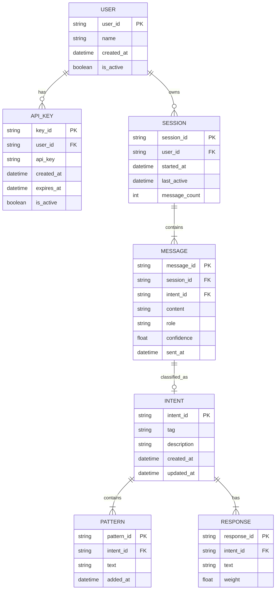

# Database Design

## Overview
The chatbot uses a combination of file-based storage (JSON) and SQLite for persistence. This document details the data structures and relationships.

## 1. ER Diagram


## 2. Schema Details

### Users Table
```sql
CREATE TABLE users (
    user_id TEXT PRIMARY KEY,
    name TEXT NOT NULL,
    created_at TIMESTAMP DEFAULT CURRENT_TIMESTAMP,
    is_active BOOLEAN DEFAULT TRUE
);
```

### API Keys Table
```sql
CREATE TABLE api_keys (
    key_id TEXT PRIMARY KEY,
    user_id TEXT NOT NULL,
    api_key TEXT UNIQUE NOT NULL,
    created_at TIMESTAMP DEFAULT CURRENT_TIMESTAMP,
    expires_at TIMESTAMP,
    is_active BOOLEAN DEFAULT TRUE,
    FOREIGN KEY (user_id) REFERENCES users(user_id)
);
```

### Sessions Table
```sql
CREATE TABLE sessions (
    session_id TEXT PRIMARY KEY,
    user_id TEXT NOT NULL,
    started_at TIMESTAMP DEFAULT CURRENT_TIMESTAMP,
    last_active TIMESTAMP DEFAULT CURRENT_TIMESTAMP,
    message_count INTEGER DEFAULT 0,
    FOREIGN KEY (user_id) REFERENCES users(user_id)
);
```

### Messages Table
```sql
CREATE TABLE messages (
    message_id TEXT PRIMARY KEY,
    session_id TEXT NOT NULL,
    intent_id TEXT,
    content TEXT NOT NULL,
    role TEXT CHECK(role IN ('user', 'bot')),
    confidence REAL,
    sent_at TIMESTAMP DEFAULT CURRENT_TIMESTAMP,
    FOREIGN KEY (session_id) REFERENCES sessions(session_id),
    FOREIGN KEY (intent_id) REFERENCES intents(intent_id)
);
```

### Intents Table
```sql
CREATE TABLE intents (
    intent_id TEXT PRIMARY KEY,
    tag TEXT UNIQUE NOT NULL,
    description TEXT,
    created_at TIMESTAMP DEFAULT CURRENT_TIMESTAMP,
    updated_at TIMESTAMP DEFAULT CURRENT_TIMESTAMP
);
```

### Patterns Table
```sql
CREATE TABLE patterns (
    pattern_id TEXT PRIMARY KEY,
    intent_id TEXT NOT NULL,
    text TEXT NOT NULL,
    added_at TIMESTAMP DEFAULT CURRENT_TIMESTAMP,
    FOREIGN KEY (intent_id) REFERENCES intents(intent_id)
);
```

### Responses Table
```sql
CREATE TABLE responses (
    response_id TEXT PRIMARY KEY,
    intent_id TEXT NOT NULL,
    text TEXT NOT NULL,
    weight REAL DEFAULT 1.0,
    FOREIGN KEY (intent_id) REFERENCES intents(intent_id)
);
```

## 3. Relationships

### Primary Keys
- `users.user_id`: UUID for user identification
- `api_keys.key_id`: UUID for API key tracking
- `sessions.session_id`: UUID for chat sessions
- `messages.message_id`: UUID for individual messages
- `intents.intent_id`: UUID for intent classification
- `patterns.pattern_id`: UUID for training patterns
- `responses.response_id`: UUID for bot responses

### Foreign Keys
- `api_keys.user_id` → `users.user_id`
- `sessions.user_id` → `users.user_id`
- `messages.session_id` → `sessions.session_id`
- `messages.intent_id` → `intents.intent_id`
- `patterns.intent_id` → `intents.intent_id`
- `responses.intent_id` → `intents.intent_id`

### Indexes
```sql
CREATE INDEX idx_api_keys_user ON api_keys(user_id);
CREATE INDEX idx_sessions_user ON sessions(user_id);
CREATE INDEX idx_messages_session ON messages(session_id);
CREATE INDEX idx_patterns_intent ON patterns(intent_id);
CREATE INDEX idx_responses_intent ON responses(intent_id);
```

## 4. Data Access Patterns

### Common Queries
```sql
-- Get active sessions for user
SELECT * FROM sessions 
WHERE user_id = ? AND last_active > datetime('now', '-1 day');

-- Get conversation history
SELECT * FROM messages 
WHERE session_id = ? 
ORDER BY sent_at ASC;

-- Find intent patterns
SELECT p.text FROM patterns p
JOIN intents i ON p.intent_id = i.intent_id
WHERE i.tag = ?;

-- Get random response for intent
SELECT text FROM responses
WHERE intent_id = ?
ORDER BY RANDOM() LIMIT 1;
```

## 5. File-Based Storage

### Session Files (JSON)
```json
{
    "session_id": "uuid",
    "user_id": "uuid",
    "messages": [
        {
            "role": "user",
            "content": "Hello",
            "timestamp": "2025-09-11T10:00:00Z"
        }
    ]
}
```

### Intent Files (JSON)
```json
{
    "tag": "greeting",
    "patterns": [
        "Hello",
        "Hi there"
    ],
    "responses": [
        "Hi!",
        "Hello!"
    ]
}
```

## 6. Backup and Maintenance
- Daily SQLite database backup
- Regular vacuum and optimization
- Index rebuilding schedule
- Data retention policy
