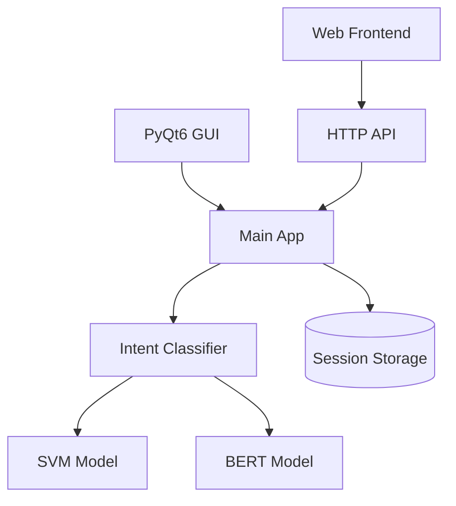

# Operations Guide

## System Architecture


## Deployment Options

### Local Development
```bash
python main.py
```

### Production Server
```bash
# Using systemd
sudo systemctl start chatbot
```

### Docker Container
```bash
docker-compose up -d
```

## Monitoring & Maintenance

### Log Files
- `logs/app.log`: Main application
- `logs/api.log`: API requests
- `logs/training.log`: Model training

### Health Checks
```bash
# API status
curl http://localhost:8080/health

# Model status
python tools/check_model.py

# System resources
htop  # CPU/Memory
nvidia-smi  # GPU
```

### Backup Procedures
1. Session data: `data/sessions/`
2. Model files: `model/svm/` and `model/bert/`
3. Configuration: `config.py`
4. API keys: `utils/api_keys.json`

## Scaling

### Horizontal Scaling
- Load balancer configuration
- Multiple API instances
- Session synchronization

### Vertical Scaling
- GPU utilization
- Memory optimization
- CPU cores

## Disaster Recovery

### Backup Restoration
```bash
# Restore from backup
python tools/restore.py --backup latest

# Verify integrity
python tools/verify_model.py
```

### Failover Procedures
1. Stop service
2. Switch to backup
3. Restore data
4. Verify operation

## Security

### API Key Management
- Generation
- Rotation
- Revocation
- Monitoring

### Access Control
- Rate limiting
- IP whitelisting
- Role-based access

## Performance Tuning

### Model Optimization
- Batch size
- Cache settings
- GPU utilization

### API Optimization
- Connection pooling
- Response caching
- Compression

## Troubleshooting

### Common Issues
1. High latency
2. Memory leaks
3. GPU errors
4. API timeouts

### Solutions
1. Clear cache
2. Restart services
3. Check logs
4. Update config

## Maintenance Tasks

### Daily
- Check logs
- Monitor resources
- Verify backups

### Weekly
- Analyze metrics
- Update API keys
- Clean old sessions

### Monthly
- Full backup
- Security updates
- Performance review

## Emergency Procedures

### Service Outage
1. Check logs
2. Restart service
3. Notify users
4. Investigate cause

### Data Loss
1. Stop service
2. Restore backup
3. Verify integrity
4. Resume operation

### Security Breach
1. Revoke keys
2. Lock down API
3. Investigate logs
4. Update security

## Metrics & Monitoring

### Key Metrics
- Response time
- Error rate
- Model accuracy
- Resource usage

### Alerts
- Service down
- High latency
- Error spike
- Resource exhaustion

## Capacity Planning

### Resources
- CPU usage
- Memory usage
- Disk space
- Network bandwidth

### Scaling Triggers
- Response time > 500ms
- CPU usage > 80%
- Memory usage > 90%
- Error rate > 1%

## Documentation

### System Docs
- Architecture
- Configuration
- API reference
- Deployment guide

### Procedures
- Installation
- Backup/restore
- Troubleshooting
- Emergency response

## Contact Information

### Support Team
- Level 1: First response
- Level 2: Technical support
- Level 3: Development team

### Emergency Contacts
- System admin
- Database admin
- Security team
- Management
