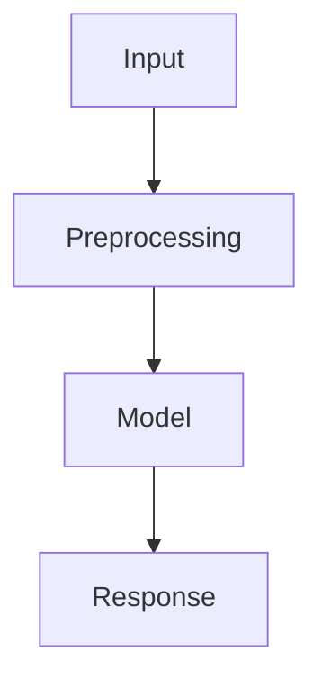

# High Level Design

## 1. Architecture Overview
TODO: Insert architecture diagram and description.

## 2. Module Descriptions
- TODO: List and describe major modules.

## 3. Data Flow Diagram

```mermaid
flowchart TD
    Input --> Preprocessing --> Model --> Response
```
