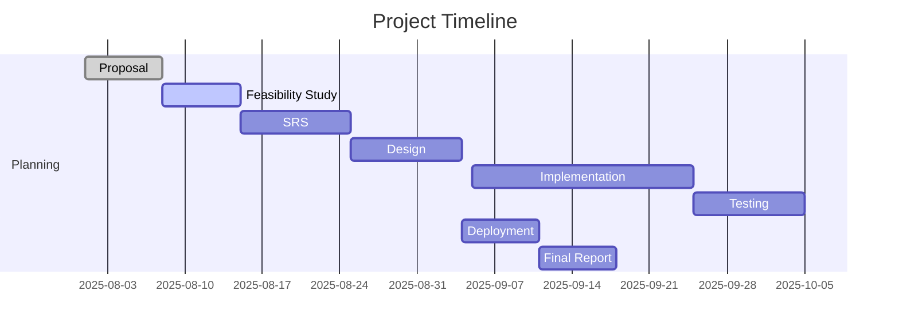

# Project Plan & Timeline

## 1. Milestones
- TODO: List key milestones and deliverables.

## 2. Gantt Chart

```mermaid
gantt
    title Project Timeline
    dateFormat  YYYY-MM-DD
    section Planning
    Proposal           :done,    des1, 2025-08-01, 7d
    Feasibility Study  :active,  des2, 2025-08-08, 7d
    SRS                :         des3, 2025-08-15, 10d
    Design             :         des4, 2025-08-25, 10d
    Implementation     :         des5, 2025-09-05, 20d
    Testing            :         des6, 2025-09-25, 10d
    Deployment         :         des7, 2025-09-04, 7d
    Final Report       :         des8, 2025-09-11, 7d
```
