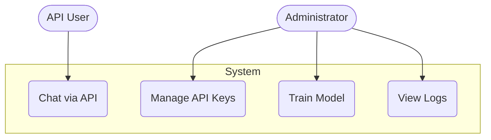
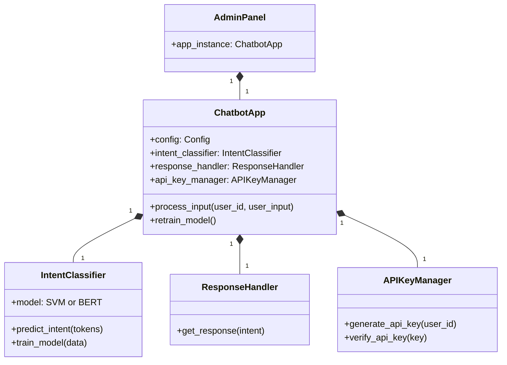

# Software Requirements Specification (SRS) - Intelligent Chatbot

## 1. Introduction

### 1.1 Purpose
This document provides a detailed description of the requirements for the Intelligent Chatbot system. It is intended for developers, project managers, and testers to understand the system's functionalities, capabilities, and constraints.

### 1.2 Scope
The project, referred to as the Intelligent Chatbot, is a modular and extensible platform for building and managing conversational AI. The scope includes:
-   A core engine for natural language understanding (NLU), including intent classification and entity extraction.
-   Support for multiple, swappable machine learning models (SVM and BERT).
-   A secure, RESTful API for programmatic interaction with the chatbot.
-   A comprehensive desktop Admin Panel (built with PyQt6) for testing, management, and configuration.
-   A database for storing API keys and session logs.
-   Deployment support via Docker.

### 1.3 Definitions, Acronyms, Abbreviations
-   **NLU**: Natural Language Understanding
-   **SVM**: Support Vector Machine
-   **BERT**: Bidirectional Encoder Representations from Transformers
-   **API**: Application Programming Interface
-   **GUI**: Graphical User Interface
-   **CRUD**: Create, Read, Update, Delete
-   **NER**: Named Entity Recognition

### 1.4 References
-   [PEP 8 -- Style Guide for Python Code](https://www.python.org/dev/peps/pep-0008/)
-   [FastAPI Documentation](https://fastapi.tiangolo.com/)
-   [PyQt6 Documentation](https://www.riverbankcomputing.com/static/Docs/PyQt6/)

### 1.5 Overview
This SRS document is organized into three main sections. Section 2 provides an overall description of the product. Section 3 details the specific functional and non-functional requirements. Section 4 provides high-level UML diagrams to visualize the system's structure.

## 2. Overall Description

### 2.1 Product Perspective
The Intelligent Chatbot is a self-contained system that can be integrated into other applications via its REST API. It operates independently and manages its own data, models, and user access through a dedicated database.

### 2.2 Product Functions
The major functions of the chatbot system are:
-   **Intent Classification**: Classify user input into predefined categories.
-   **Response Generation**: Provide appropriate responses based on the classified intent.
-   **Context Management**: Maintain conversation history to handle multi-turn dialogues.
-   **API Key Management**: Securely manage access for API clients.
-   **Model Training**: Allow administrators to retrain the NLU model with new data.
-   **API Serving**: Expose chatbot functionality via a secure HTTP API.
-   **System Administration**: Provide a GUI for system monitoring and management.

### 2.3 User Classes and Characteristics
1.  **Administrator**: A technical user responsible for managing, training, and monitoring the chatbot. They interact with the system via the PyQt6 Admin Panel. They have full access to all features.
2.  **API User**: A developer or external system that interacts with the chatbot programmatically via the REST API. Access is authenticated via an API key.

### 2.4 Operating Environment
-   **Backend**: Python 3.9+
-   **API Server**: FastAPI with Uvicorn
-   **Admin Panel**: PyQt6
-   **Database**: SQLite
-   **Deployment**: Can be run directly on a host machine (Linux, macOS, Windows) or within a Docker container.
-   **Hardware**: A GPU is recommended for training the BERT model but is not required for running the application.

### 2.5 Design and Implementation Constraints
-   The system must be modular to allow for future expansion (e.g., adding new model types).
-   The API must be stateless, with conversation context managed on the server side based on the user's session.
-   The Admin Panel is a desktop application and is not required for the API server to function.

### 2.6 Assumptions and Dependencies
-   The server running the application has a stable internet connection for downloading models (spaCy, BERT) and for the Google Search fallback feature.
-   Users are responsible for the quality and quantity of their intent training data.

## 3. Specific Requirements

### 3.1 Functional Requirements

| ID | Requirement |
|---|---|
| FR-01 | The system shall classify a user's text input into one of the predefined intents. |
| FR-02 | The system shall support both SVM and BERT as intent classification models. |
| FR-03 | The system shall provide a relevant response based on the classified intent. |
| FR-04 | The system shall maintain a short-term memory (context) of the last few turns of a conversation. |
| FR-05 | The system shall provide a RESTful API endpoint (`POST /chat`) for receiving messages and returning responses. |
| FR-06 | All API endpoints must be authenticated using an API key sent in the `X-API-Key` header. |
| FR-07 | The Admin Panel shall provide an interface for generating, viewing, and deleting API keys. |
| FR-08 | The Admin Panel shall allow an administrator to trigger model retraining. |
| FR-09 | The retraining process can be run in a background thread to prevent application downtime. |
| FR-10 | The Admin Panel shall provide an interface for testing the chatbot in real-time. |
| FR-11 | The system shall log all API interactions to a database for auditing purposes. |
| FR-12 | The system shall be deployable as a Docker container. |
| FR-13 | If an intent cannot be determined with sufficient confidence, the system can use a Google Search fallback if enabled. |

### 3.2 Non-Functional Requirements

| ID | Requirement |
|---|---|
| NFR-01 | **Performance**: The API endpoint `/chat` should respond in under 500ms for the SVM model and under 1000ms for the BERT model under normal load. |
| NFR-02 | **Security**: API keys must be hashed before being stored in the database. |
| NFR-03 | **Reliability**: The API server should be available 99.9% of the time when deployed correctly. |
| NFR-04 | **Usability**: The Admin Panel shall be intuitive for technical users to manage the system without needing to edit code. |
| NFR-05 | **Scalability**: The application should be scalable horizontally by running multiple instances behind a load balancer (requires a centralized database like PostgreSQL instead of SQLite for production scaling). |
| NFR-06 | **Maintainability**: The codebase must be well-documented with docstrings and adhere to PEP 8 standards. |

### 3.3 External Interface Requirements
-   **REST API**: The system exposes an HTTP-based REST API as defined in the `docs/api_documentation.md` file. The API uses JSON for requests and responses.

## 4. UML Diagrams

### 4.1 Use Case Diagram
A simplified diagram showing the main interactions.

### 4.2 Class Diagram
A high-level diagram of the core application classes.
