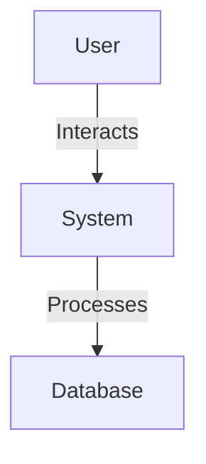
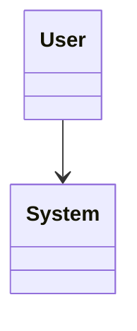

# Software Requirements Specification (SRS)

## 1. Introduction
### 1.1 Purpose
TODO: State the purpose of the SRS.
### 1.2 Scope
TODO: Define the scope of <Project Name>.
### 1.3 Definitions, Acronyms, Abbreviations
TODO: List relevant terms.
### 1.4 References
TODO: Cite references.
### 1.5 Overview
TODO: Brief overview of document structure.

## 2. Overall Description
### 2.1 Product Perspective
TODO: Context and relationship to other systems.
### 2.2 Product Functions
TODO: List major functions.
### 2.3 User Classes and Characteristics
TODO: Describe user types.
### 2.4 Operating Environment
TODO: Specify hardware/software.
### 2.5 Design and Implementation Constraints
TODO: List constraints.
### 2.6 Assumptions and Dependencies
TODO: List assumptions.

## 3. Specific Requirements
### 3.1 Functional Requirements
- TODO: List all functional requirements.
### 3.2 Non-Functional Requirements
- TODO: List all non-functional requirements.
### 3.3 External Interface Requirements
- TODO: Describe interfaces.

## 4. UML Diagrams
### 4.1 Use Case Diagram

### 4.2 Class Diagram

